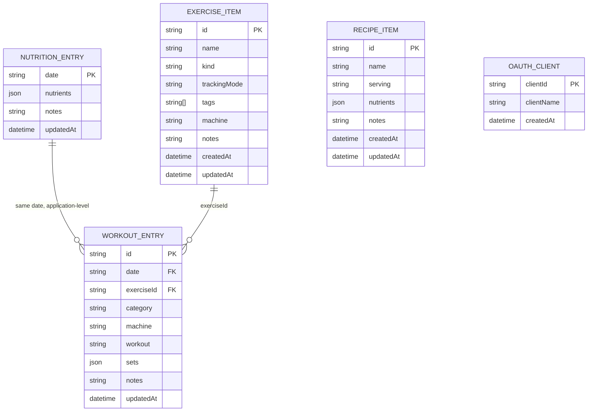

# FitCheck

FitCheck is a single-user nutrition and workout ledger with a Hono web dashboard and an authenticated MCP server. It is deployed at:

`https://fitcheck.dev.prettybird.zapplebee.online`

MCP endpoint:

`https://fitcheck.dev.prettybird.zapplebee.online/mcp`

This README is the project handoff. An agent working on FitCheck must read it before changing code and must update it whenever architecture, data shape, tools, deployment, visual style, or operational behavior changes.

## Start Here

The application is intentionally small and file-backed:

- `src/index.tsx` contains the Hono server, MCP tools, schemas, LowDB access, logging, HTML shell, and CSS.
- `src/client.tsx` contains the browser dashboard, calendar, recipes page, exercise catalog, day detail page, and client-side calculations.
- `public/client.js` is generated by `bun run build:client`; do not hand-edit it.
- `data/state.json` stores nutrition, workouts, and OAuth client registrations.
- `data/recipes.json` stores reusable recipe or food catalog items.
- `data/exercises.json` stores reusable exercises and machines.
- `data/fitcheck-events.log` is an append-only Winston JSON event log.
- `docker-compose.yml` mounts `./data` at `/data` and connects the service to the external `nyx_svc_dev` Docker network.

The current deployed data has no workout history. Nutrition and the exercise catalog are separate and remain present. Do not delete or rewrite data without explicit confirmation.

## Local Development

Requirements: Bun and Docker. Install dependencies and run checks:

```sh
bun install
bun run typecheck
bun run build:client
```

Run directly with local paths:

```sh
bun run start
```

The default local port is `3000`. The default development access token is `fitcheck-dev-token`; use `.env` for real deployment secrets. Never commit `.env` or tokens.

## Deployment

The host must already have the external Docker network `nyx_svc_dev` and Traefik configured. From this directory:

```sh
docker compose up -d --build
```

Useful operations:

```sh
docker compose ps
docker compose logs --no-color --tail 50 fitcheck
curl -fsS https://fitcheck.dev.prettybird.zapplebee.online/health
docker compose restart fitcheck
```

The compose service is named `fitcheck`, uses image `fitcheck:latest`, and routes HTTPS through Traefik using the `fitcheck.dev.prettybird.zapplebee.online` host rule. The `/data` bind mount is the persistence boundary. Back up `data/` before migrations or destructive maintenance.

## Configuration

Compose supplies these paths and values:

| Variable | Default or deployment value | Purpose |
| --- | --- | --- |
| `DATA_PATH` | `/data/state.json` in Compose | Nutrition, workouts, OAuth clients |
| `RECIPES_DATA_PATH` | `/data/recipes.json` in Compose | Recipe and food catalog |
| `EXERCISES_DATA_PATH` | `/data/exercises.json` in Compose | Exercise and machine catalog |
| `LOG_PATH` | `${dirname(DATA_PATH)}/fitcheck-events.log` | Append-only Winston log |
| `PUBLIC_BASE_URL` | FitCheck HTTPS URL | OAuth metadata and MCP resource metadata |
| `FITCHECK_ACCESS_TOKEN` | `fitcheck-dev-token` if unset | Bearer token for `/mcp` |
| `GH_TOKEN` or `GITHUB_TOKEN` | unset | Optional GitHub issue tools |
| `GITHUB_REPOSITORY` | `zapplebee/fitcheck` | GitHub issue target |
| `PORT` | `3000` | HTTP listener inside the container |

## Data Model

Nutrition is keyed by ISO date (`YYYY-MM-DD`) and nutrients are an extensible numeric map. A workout belongs to a date and contains zero or more sets. New workouts require an `exerciseId` that points to the exercise catalog; `trackingMode` is intentionally stored on the catalog item, not copied onto the workout.

Exercise catalog items have a generated UUID, name, kind, tags, and one tracking mode:

- `sets_reps_weight`: use `reps` and/or `weight` in sets.
- `duration_distance`: use `durationMinutes` and/or `distance` in sets.

Existing catalog entries are migrated on startup. Cardio entries default to `duration_distance`; all other kinds default to `sets_reps_weight`. Historical or unlinked workouts remain readable through field-based mode inference.



LowDB stores these entities in three JSON files rather than a relational database. The ERD shows logical relationships; the date relationship is not a database foreign key.

## MCP Tools

The `/mcp` endpoint requires `Authorization: Bearer <FITCHECK_ACCESS_TOKEN>`. OAuth/DCR endpoints are intentionally lightweight and single-user oriented:

- `get_state` returns nutrition and workouts.
- `get_summary` returns rolling nutrition averages and recent workout summaries.
- `upsert_nutrition` merges nutrient values for a date.
- `upsert_workout` creates or updates a workout and requires an existing catalog `exerciseId`.
- `delete_workout` removes one workout by ID.
- `list_exercise_catalog` searches reusable exercises and machines.
- `get_exercise_catalog_item` returns one exercise by UUID.
- `create_exercise_catalog_item` creates a tagged exercise with required `trackingMode`.
- `delete_exercise_catalog_item` deletes only the catalog item and preserves historical workouts.
- `list_catalog_items`, `get_catalog_item`, and `create_catalog_item` manage recipes and food definitions.
- `list_github_issues`, `create_github_issue`, and `comment_github_issue` manage GitHub issues when a GitHub token is configured.

Use `list_exercise_catalog` before logging a workout. Do not create duplicate catalog entries. Tags are limited to `plyometric`, `upper`, `lower`, `core`, `rehab`, and `cardio`.

## Logging And Recovery

Winston writes JSON events to `data/fitcheck-events.log` with the file transport opened in append mode. Console output uses the same structured events. HTTP requests and MCP calls are logged for operations, while every data mutation records the operation, entity, and complete `before` and `after` values where applicable. Deletions retain the deleted object in `before`.

Review logs with:

```sh
docker compose logs --no-color fitcheck
less data/fitcheck-events.log
```

The event log is not a substitute for backups. Preserve both `data/` and the event log. Any new write path must use `logMutation` after a successful file write and must never truncate or rewrite the event log.

## Nyx Visual Style

FitCheck uses the Nyx visual language: a tactile paper ledger or field manual rather than a generic SaaS dashboard. Preserve this direction when adding UI:

- Use warm paper backgrounds (`#fbf8ef` and `#efe6d1`) over a faint 32px grid.
- Use dark navy ink and hard navy borders (`#071a33` and `#092345`), with offset block shadows instead of soft elevation.
- Use Georgia or another editorial serif for headings and body copy.
- Use a restrained monospace face for labels, navigation, IDs, tags, statuses, and controls.
- Prefer squared corners, 2px or 3px rules, compact panels, visible outlines, and print-like hierarchy.
- Use muted green, orange, blue, and lavender fills only as semantic accents for workout categories.
- Keep interactions keyboard-visible: outlined focus states, readable contrast, and real buttons/links.
- Preserve responsive behavior. The current layout collapses grids to one column below 880px.
- Do not introduce gradients, glassmorphism, rounded card stacks, default Tailwind-looking dashboards, or unrelated color systems.

The canonical tokens and CSS are in the `styles` template in `src/index.tsx`. Match those tokens before inventing new ones.

## Agent Instructions

Before implementing a feature:

1. Read this README, `src/index.tsx`, `src/client.tsx`, the relevant JSON files, and `docker-compose.yml`.
2. Check `git status` and preserve unrelated user changes.
3. Inspect existing MCP tools and catalog items before adding new entities or duplicate tools.
4. Treat `data/` as user data. Make migrations explicit, idempotent, and non-destructive.

After implementing a feature:

1. Update this README in the same change whenever the data model, tools, routes, deployment, logging, visual style, or operational behavior changes.
2. Add or update a Mermaid ERD if entities or relationships change.
3. Run `bun run typecheck`, `bun run build:client`, and `git diff --check`.
4. Deploy with `docker compose up -d --build` when deployment is requested or when validating the live service.
5. Verify `/health` and any affected API or MCP behavior.
6. Report data migrations, tests, deployment status, and any unrecoverable data limitations clearly.
